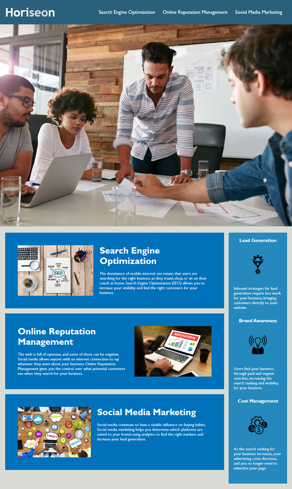

# horiseon-refactor-

## Description

The intent of this was to clean up the CSS code by combining selectors with commas, check for HTML items thats were unusable and give it back better then I got it. Solved the search engine Nav bar problem.

changed title to "horiseon"

line 29 was missing "id="search-engine-optimization"

grouped many css selectors

fixed/optimized heading sizes by adding "align="center"" and going from h3-h2

deleted- ".header h1 .seo {
    background-color: #d9dcd6;
}

